[](https://travis-ci.org/IBM/watson-discovery-sdu-with-assistant)

# Enhance customer helpdesks with Smart Document Understanding

In this code pattern, we walk you through a working example of a web app that utilizes multiple Watson services to create a better customer care experience.

Using the Watson Discovery Smart Document Understanding (SDU) feature, we will enhance the Discovery model so that queries will be better focused to only search the most relevant information found in a typical owner's manual.

Using Watson Assistant, we will use a standard customer care dialog to handle a typical conversation between a custmomer and a company representitive. When a customer question involves operation of a product, the Assistant dialog will communicate with the Discovery service using a webhook.

The webhook will be created by defining a `web action` using IBM Cloud Functions.

## What is SDU?

SDU trains Watson Discovery to extract custom fields in your documents. Customizing how your documents are indexed into Discovery will improve the answers returned from queries.

With SDU, you annotate fields within your documents to train custom conversion models. As you annotate, Watson is learning and will start predicting annotations. SDU models can also be exported and used on other collections.

Current document type support for SDU is based on your plan:

  * Lite plans: PDF, Word, PowerPoint, Excel, JSON, HTML
  * Advanced plans: PDF, Word, PowerPoint, Excel, PNG, TIFF, JPG, JSON, HTML

Here is a great video that provides an overview of the benefits of SDU, and a walk-through of how to apply it to your document:

[](https://www.youtube.com/watch?v=Jpr3wVH3FVA)

## What is a webhook?

A webhook is a mechanism that allows you to call out to an external program based on something happening in your program. When used in a Watson Assistant dialog skill, a webhook is triggered when the Assistant processes a node that has a webhook enabled. The webhook collects data that you specify or that you collect from the user during the conversation and save in context variables, and sends the data to the Webhook request URL as an HTTP POST request. The URL that receives the webhook is the listener. It performs a predefined action using the information that is provided by the webhook as specified in the webhook definition, and can optionally return a response.

In our example, the webhook will communicate with an IBM Cloud Functions `web action`, which is connected to the Watson Discovery service.

> **Note**: Another method of integrating Watson Assistant with Watson Discovery is through the use of a new feature of Watson Assistant called a [search skill](https://cloud.ibm.com/docs/services/assistant?topic=assistant-skill-search-add). Click [here](https://github.com/IBM/watson-assistant-with-search-skill) to view a code pattern that showcases this feature.

## Flow

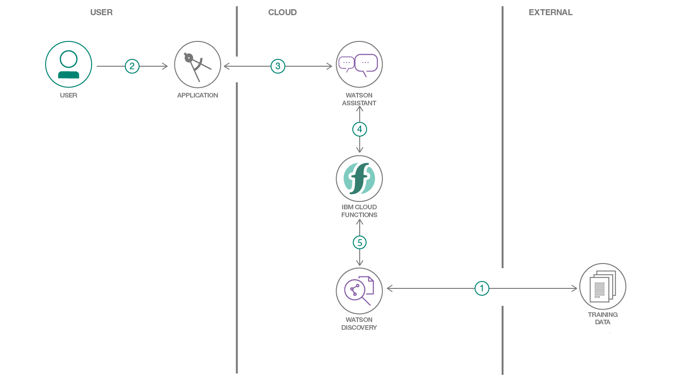

1. The document is annotated using Watson Discovery SDU
1. The user interacts with the backend server via the app UI. The frontend app UI is a chatbot that engages the user in a conversation.
1. Dialog between the user and backend server is coordinated using a Watson Assistant dialog skill.
1. If the user asks a product operation question, a search query is passed to a predefined IBM Cloud Functions action.
1. The Cloud Functions action will query the Watson Discovery service and return the results.

# Watch the Video

[](https://youtu.be/-yniuX-Poyw)

# Steps:

1. [Clone the repo](#1-clone-the-repo)
1. [Create IBM Cloud services](#2-create-ibm-cloud-services)
1. [Configure Watson Discovery](#3-configure-watson-discovery)
1. [Create IBM Cloud Functions action](#4-create-ibm-cloud-functions-action)
1. [Configure Watson Assistant](#5-configure-watson-assistant)
1. [Get IBM Cloud services credentials and add to .env file](#6-get-ibm-cloud-services-credentials-and-add-to-env-file)
1. [Run the application](#7-run-the-application)

### 1. Clone the repo

```bash
git clone https://github.com/IBM/watson-discovery-sdu-with-assistant
```

### 2. Create IBM Cloud services

Create the following services:

* [**Watson Discovery**](https://cloud.ibm.com/catalog/services/discovery)
* [**Watson Assistant**](https://cloud.ibm.com/catalog/services/assistant)

### 3. Configure Watson Discovery

#### Import the document

As shown below, launch the `Watson Discovery` tool and create a new data collection by selecting the `Upload your own data` option. Give the data collection a unique name. When prompted, select and upload the `ecobee3_UserGuide.pdf` file located in the `data` directory of your local repo.


The `Ecobee` is a popular residential thermostat that has a wifi interface and multiple configuration options.

Before applying SDU to our document, lets do some simple queries on the data so that we can compare it to results found after applying SDU.


Click the `Build your own query` [1] button.


Enter queries related to the operation of the thermostat and view the results. As you will see, the results are not very useful, and in some cases, not even related to the question.

#### Annotate with SDU

Now let's apply SDU to our document to see if we can generate some better query responses.

From the Discovery collection panel, click the `Configure data` button (located in the top right corner) to start the SDU process.

Here is the layout of the `Identify fields` tab of the SDU annotation panel:


The goal is to annotate all of the pages in the document so Discovery can learn what text is important, and what text can be ignored.

* [1] is the list of pages in the manual. As each is processed, a green check mark will appear on the page.
* [2] is the current page being annotated.
* [3] is where you select text and assign it a label.
* [4] is the list of labels you can assign to the page text.
* Click [5] to submit the page to Discovery.
* Click [6] when you have completed the annotation process.

As you go though the annotations one page at a time, Discovery is learning and should start automatically updating the upcoming pages. Once you get to a page that is already correctly annotated, you can stop, or simply click `Submit` [5] to acknowledge it is correct. The more pages you annotate, the better the model will be trained.

For this specific owner's manual, at a minimum, it is suggested to mark the following:

* The main title page as `title`
* The table of contents (shown in the first few pages) as `table_of_contents`
* All headers and sub-headers (typed in light green text) as a `subtitle`
* All page numbers as `footers`
* All warranty and licensing infomation (located in the last few pages) as a `footer`
* All other text should be marked as `text`.

Once you click the `Apply changes to collection` button [6], you will be asked to reload the document. Choose the same owner's manual `.pdf` document as before.

Next, click on the `Manage fields` [1] tab.


* [2] Here is where you tell Discovery which fields to ignore. Using the `on/off` buttons, turn off all labels except `subtitles` and `text`.
* [3] is telling Discovery to split the document apart, based on `subtitle`.
* Click [4] to submit your changes.

Once again, you will be asked to reload the document.

Now, as a result of splitting the document apart, your collection will look very different:


Return to the query panel (click `Build your own query`) and see how much better the results are.


#### Store credentials for future use

In upcoming steps, you will need to provide the credentials to access your Discovery collection. The values can be found in the following locations.

The `Collection ID` and `Environment ID` values can be found by clicking the dropdown button [1] located at the top right side of your collection panel:


For credentials, return to the main panel of your Discovery service, and click the `Service credentials` [1] tab:

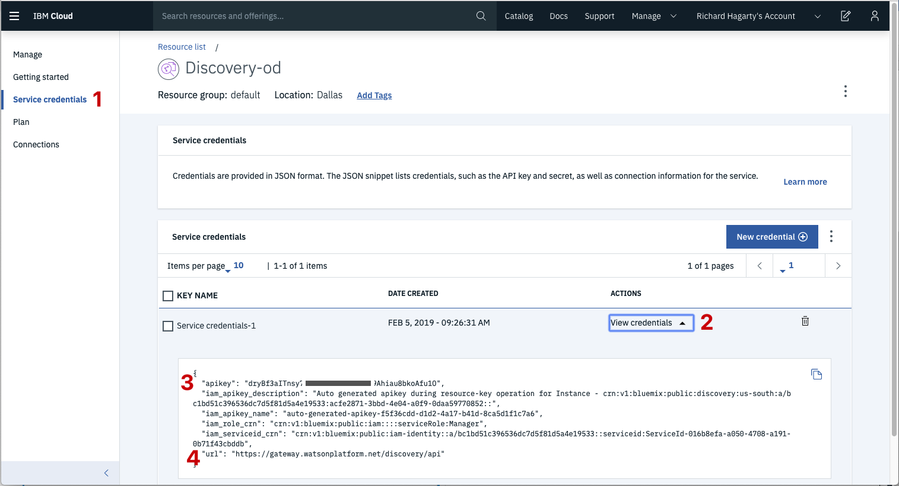

Click the `View credentials` [2] drop-down menu to view the IAM `apikey` [3] and `URL` endpoint [4] for your service.

### 4. Create IBM Cloud Functions action

Now let's create the `web action` that will make queries against our Discovery collection.

Start the `IBM Cloud Functions` service by selecting `Create Resource` from the IBM Cloud dashboard. Enter `functions` as the filter [1], then select the `Functions` card [2]:


From the `Functions` main panel, click on the `Actions` tab. Then click on `Create`.

From the `Create` panel, select the `Create Action` option.

On the `Create Action` panel, provide a unique `Action Name` [1], keep the default package [2], and select the `Node.js 10` [3] runtime. Click the `Create` button [4] to create the action.


Once your action is created, click on the `Code` tab [1]:

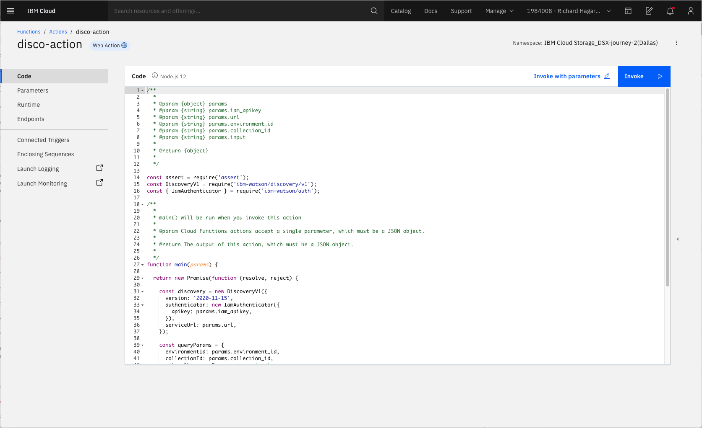

In the code editor window [2], cut and paste in the code from the `disco-action.js` file found in the `actions` directory of your local repo. The code is pretty straight-forward - it simply connects to the Discovery service, makes a query against the collection, then returns the response.

If you press the `Invoke` button [3], it will fail due to credentials not being defined yet. We'll do this next.

Select the `Parameters` tab [1]:

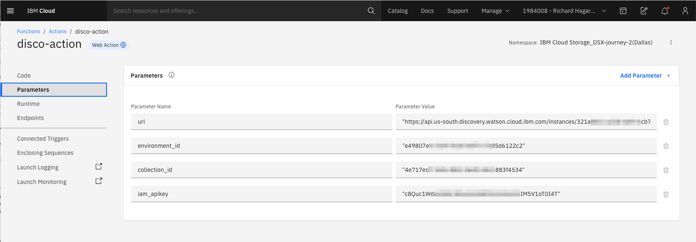

Add the following keys:

* url
* environment_id
* collection_id
* iam_apikey

For values, please use the values associated with the Discovery service you created in the previous step.

> Note: Make sure to enclose your values in double quotes.

Now that the credentials are set, return to the `Code` panel and press the `Invoke` button again. Now you should see actual results returned from the Discovery service:


Next, go to the `Endpoints` panel [1]:

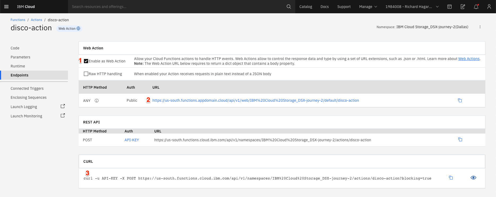

Click the checkbox for `Enable as Web Action` [2]. This will generate a public endpoint URL [3].

Take note of the URL value [3], as this will be needed by Watson Assistant in a future step.

To verify you have entered the correct Discovery parameters, execute the provied `curl` command [4]. If it fails, re-check your parameter values.

> NOTE: An IBM Cloud Functions service will not show up in your dashboard resource list. To return to your defined `Action`, you will need to access Cloud Functions by selecting `Create Resource` from the main dashboard panel (as shown at the beginning of this step).

### 5. Configure Watson Assistant

As shown below, launch the `Watson Assistant` tool and create a new dialog skill. Select the `Use sample skill` option as your starting point.


This dialog skill contains all of the nodes needed to have a typical call center conversation with a user.

#### Add new intent

The default customer care dialog does not have a way to deal with any questions involving outside resources, so we will need to add this.

Create a new `intent` that can detect when the user is asking about operating the Ecobee thermostat.

From the `Customer Care Sample Skill` panel, select the `Intents` tab.

Click the `Create intent` button.

Name the intent `#Product_Information`, and at a minimum, enter the following example questions to be associated with it.


#### Create new dialog node

Now we need to add a node to handle our intent. Click on the `Dialog` [1] tab, then click on the drop down menu for the `Small Talk` node [2], and select the `Add node below` [3] option.

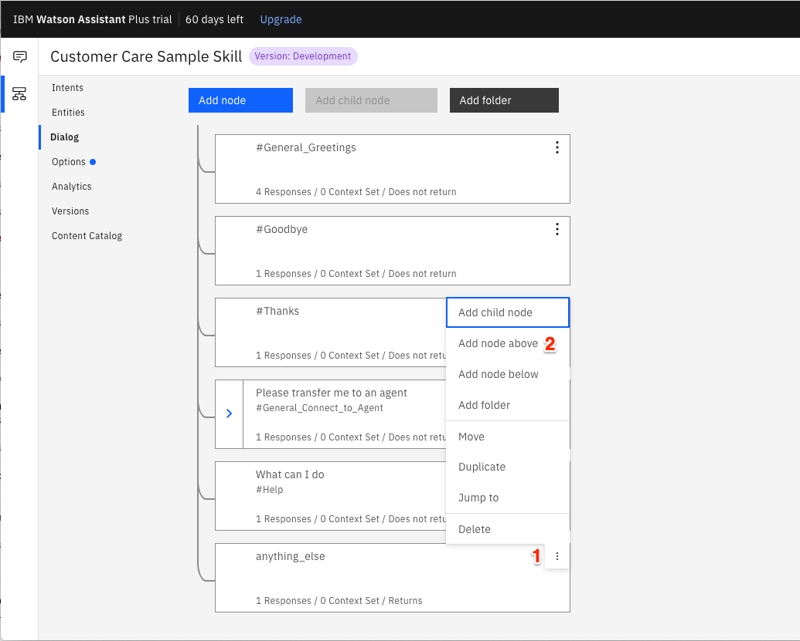

Name the node "Ask about product" [1] and assign it our new intent [2].

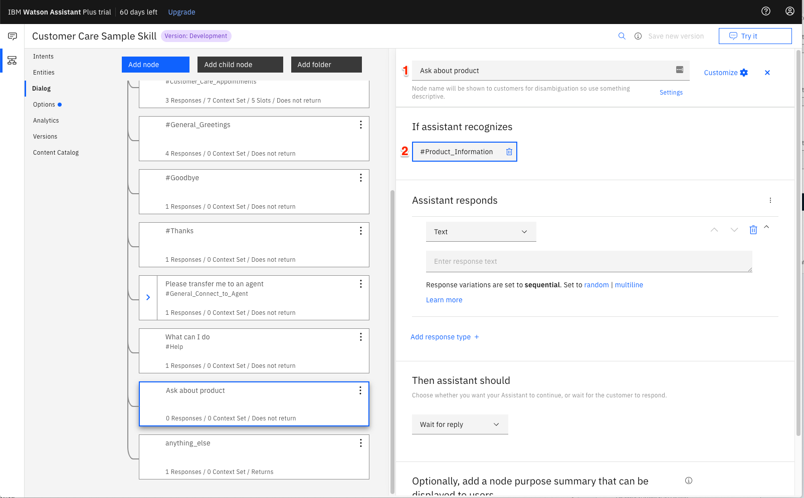

This means that if Watson Assistant recognizes a user input such as "how do I set the time?", it will direct the conversation to this node.

#### Enable webhook from Assistant

Set up access to our WebHook for the IBM Cloud Functions action you created in Step #4.

Select the `Options` tab [1]:

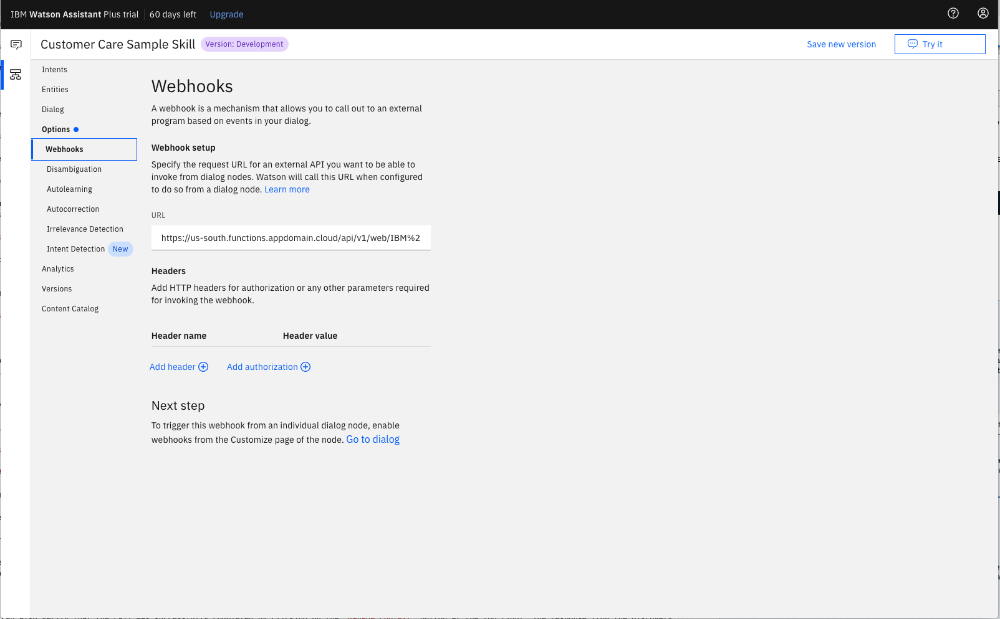

Enter the public URL endpoint for your action [2].

> **Important**: Add `.json` to the end of the URL to specify the result should be in JSON format.

Return to the `Dialog` tab, and click on the `Ask about product` node. From the details panel for the node, click on `Customize`, and enable Webhooks for this node:


Click `Apply`.

The dialog node should have a `Return variable` [1] set automatically to `$webhook_result_1`. This is the variable name you can use to access the result from the Discovery service query.


You will also need to pass in the users question via the parameter `input` [2]. The key needs to be set to the value:

```bash
"<?input.text?>"
```

If you fail to do this, Discovery will return results based on a blank query.

Optionally, you can add these responses to aid in debugging:


#### Test in Assistant Tooling

From the `Dialog` panel, click the `Try it` button located at the top right side of the panel.

Enter some user input:

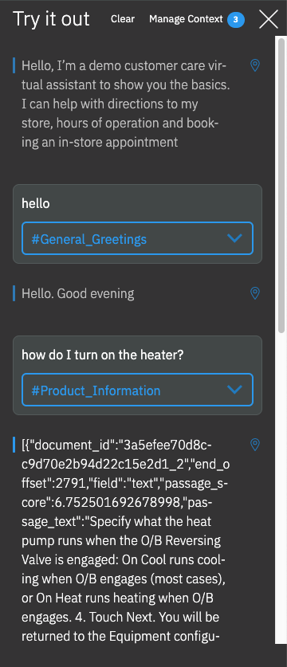

Note that the input "how do I turn on the heater?" has triggered our `Ask about product` dialog node, which is indicated by the `#Product_Information` response.

And because we specified that `$webhook_result_1.passages` be the response, that value is displayed also.

You can also verify that the call was successfully completed by clicking on the `Manage Context` button at the top right. The response from the Discovery query will be stored in the `$webhook_result_1` variable:

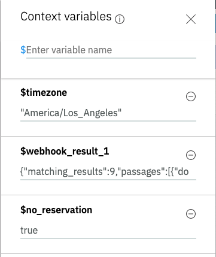

### 6. Get IBM Cloud services credentials and add to .env file

Copy the local `env.sample` file and rename it `.env`:

```bash
cp env.sample .env
```

Update the `.env` file with the credentials from your Assistant service.

```bash
# Copy this file to .env and replace the credentials with
# your own before starting the app.

# Watson Assistant
ASSIATANT_URL=<add_assistant_url>
ASSISTANT_APIKEY=<add_assistant_apikey>
ASSISTANT_SKILL_ID=<add_assistant_skill_id>

# Run locally on a non-default port (default is 3000)
# PORT=3000
```

Credentials can be found by clicking the Service Credentials tab, then the View Credentials option from the panel of your created Watson service.

An additional `ASSISTANT_SKILL_ID` value is required to access the Watson Assistant service. To get this value, select the `Manage` tab, then the `Launch tool` button from the panel of your Watson Assistance service. From the service instance panel, select your Assistant to display the assigned skills. For this code pattern, we used the dialog skill named `Custom Skill Sample Skill` that comes with the service:

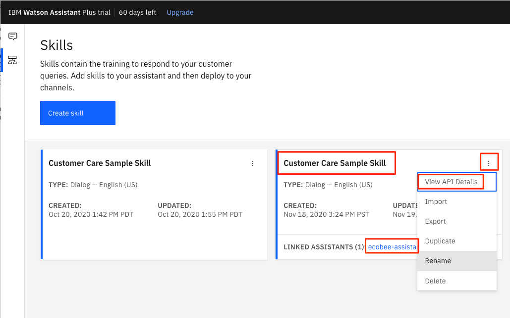

Click the option button (highlighted in the image above) to view the skill `API Details`. Here you will find the `Skill ID` value.


### 7. Run the application

```bash
npm install
npm start
```

Access the UI by pointing your browser at `localhost:3000`.

Sample questions:

* **how do I set a schedule?**
* **how do I set the temperature?**
* **how do I set the time?**

# Sample Output


# Access to results in application

* This is the format for how Discovery results will be returned in the Assistant context object:

```
{ conversation_id: '70bc6532-d3fb-4e4c-9083-7a1c752ba6ef',
  system: 
   { initialized: true,
     dialog_stack: [ { dialog_node: 'root' } ],
     dialog_turn_counter: 3,
     dialog_request_counter: 3,
     _node_output_map:
      { node_15_1488295465298: [ 0 ],
        response_1_1559767826196: [ 0 ] },
     branch_exited: true,
     branch_exited_reason: 'completed' },
  webhook_result_1:
   { matching_results: 9,
     passages:
      [ { document_id: '3a5efee70d8cc9d70e2b94d22c15e2d1_2',
          end_offset: 2791,
          field: 'text',
          passage_score: 6.752501692678998,
          passage_text: 'Specify what the heat pump runs when the O/B Reversing Valve is engaged: On Cool runs cooling when O/B engages (most cases), or On Heat runs heating when O/B engages. 4. Touch Next. You will be returned to the Equipment configuration menu. Furnaces/Boilers If you have a furnace or boiler installed: 1. Select the heating menu. 2. Configure the heater type',
          start_offset: 2435 },
```

# Learn more

* **Artificial Intelligence Code Patterns**: Enjoyed this Code Pattern? Check out our other [AI Code Patterns](https://developer.ibm.com/technologies/artificial-intelligence/)
* **AI and Data Code Pattern Playlist**: Bookmark our [playlist](https://www.youtube.com/playlist?list=PLzUbsvIyrNfknNewObx5N7uGZ5FKH0Fde) with all of our Code Pattern videos
* **With Watson**: Want to take your Watson app to the next level? Looking to utilize Watson Brand assets? [Join the With Watson program](https://www.ibm.com/watson/with-watson/) to leverage exclusive brand, marketing, and tech resources to amplify and accelerate your Watson embedded commercial solution.

# License

This code pattern is licensed under the Apache License, Version 2. Separate third-party code objects invoked within this code pattern are licensed by their respective providers pursuant to their own separate licenses. Contributions are subject to the [Developer Certificate of Origin, Version 1.1](https://developercertificate.org/) and the [Apache License, Version 2](https://www.apache.org/licenses/LICENSE-2.0.txt).

[Apache License FAQ](https://www.apache.org/foundation/license-faq.html#WhatDoesItMEAN)
